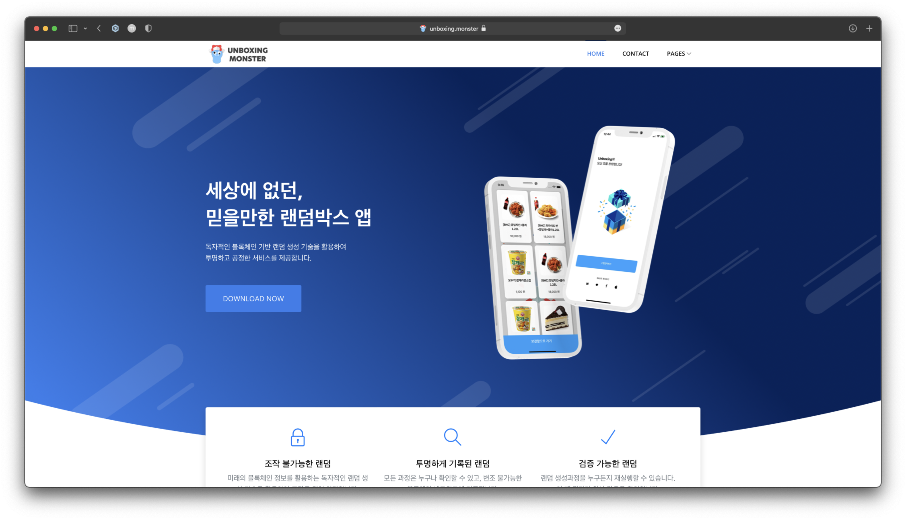
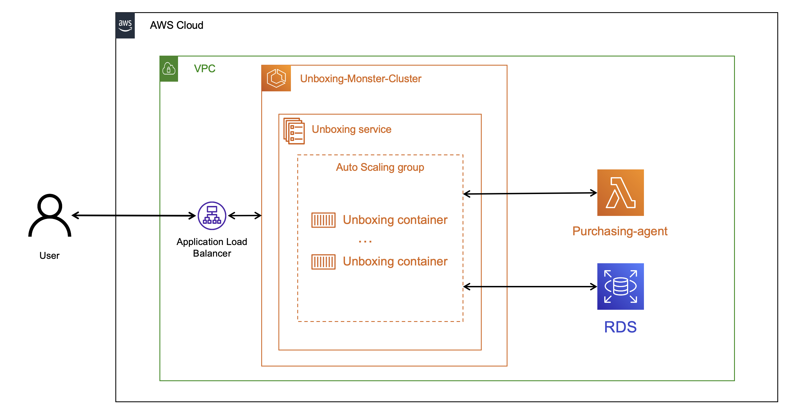
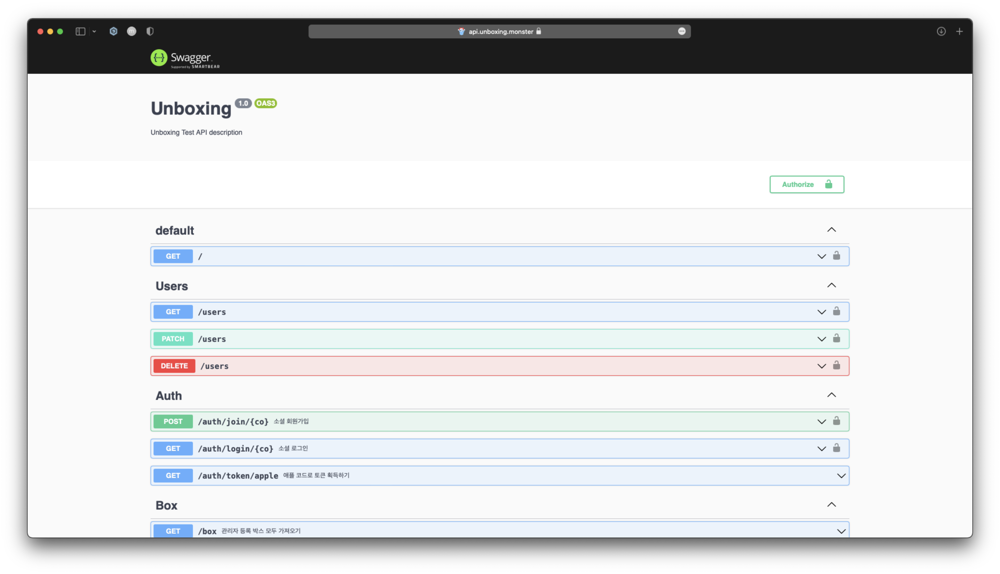

# 공정한 랜덤박스 - Unboxing monster(Server)
공정한 랜덤박스 - Unboxing monster의 서버입니다.

## About Unboxing monster
https://unboxing.monster

## Unboxing monster 설계

ELB 로 ECS 의 컨테이너 활성화 상태 확인 및 inactive 상태 컨테이너 삭제 및 컨테이너 새로 생성을 가능하게 합니다.

ECS 에서 Unboxing service 가 각 container 의 CPU, Memory 사용량을 통해 Auto Scaling 을 진행합니다.

## About unboxing monster server
***
Unboxing monster 는 nest.js로 작성되었습니다.

데이터 베이스는 AWS RDS, MySQL 을 사용 합니다.

Prisma 를 활용하여 ORM 으로 데이터베이스를 컨트롤 합니다.

## Database schema
***
각 테이블에 대한 설명 (자세한 내용은 /prisma/schema.prisma 참고)

- User
  - unboxing monster 서비스 회원 테이블
- Point
  - 회원의 포인트 사용내역 추적을 위한 테이블
- Box
  - 서비스 내의 랜덤박스를 저장하는 테이블
- Item
  - 서비스에서 제공하는 상품 테이블
- Cart
  - 회원의 장바구니 테이블
- BoxItem
  - 각 박스에 담겨진 아이템을 저장하는 테이블
- BoxPurchase
  - 구매한 박스를 기록하는 테이블
- Purchase
  - 구매(결제) 내역을 기록하는 태이블
- Notice
  - 공지사항 링크를 저장하는 테이블
- Coupon
  - 랜덤박스를 오픈하여 획득한 쿠폰을 보관하는 테이블
- CouponUsedRecord
  - 쿠폰 사용 기록을 추적하는 테이블
- BoxStorage
  - 사용자가 보관중인 랜덤박스를 저장하는 테이블
- OpenResult
  - 박스 오픈 결과를 기록하는 테이블
- Event
  - 서비스 내에서 진행하는 이벤트 참여 여부를 파악하기 위해 존재하는 테이블
- Survey
  - 서비스 내에서 진행하는 설문조사 결과를 저장하기 위해 존재하는 테이블

## API I/F 정의서
https://api.unboxing.monster/docs

